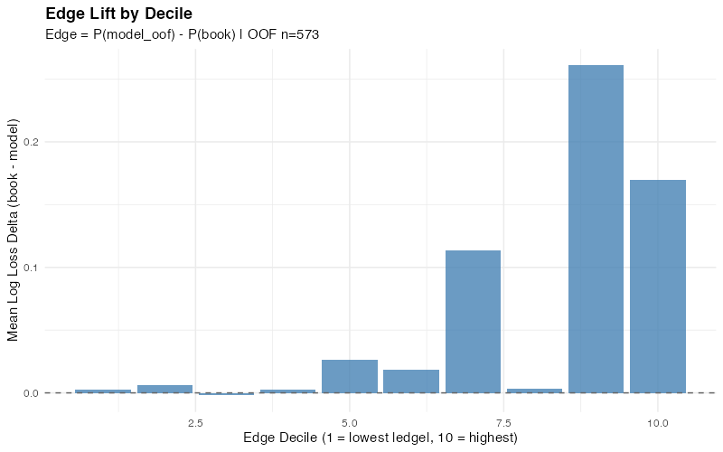
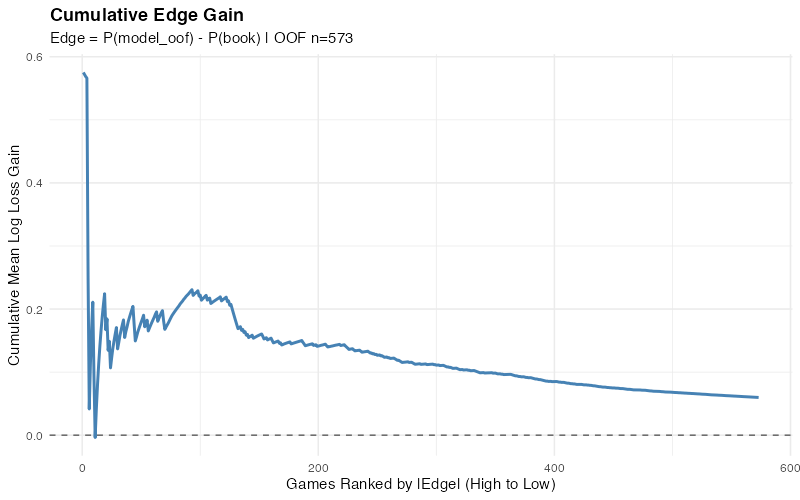
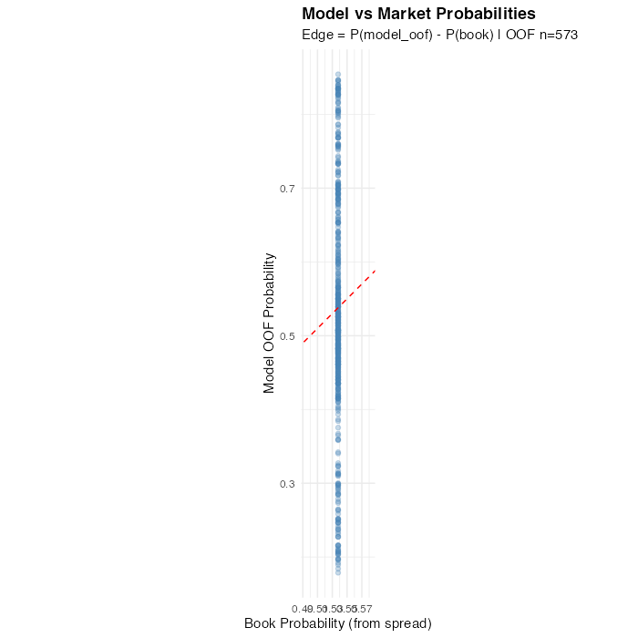
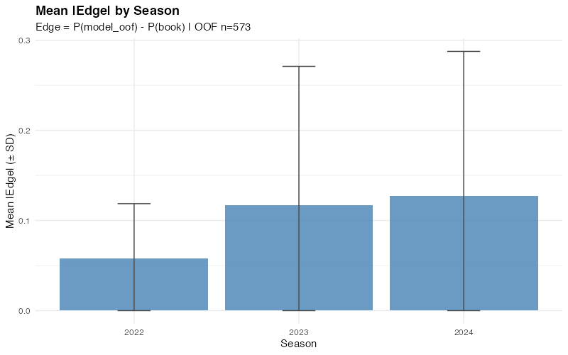

# Weekly Model Brief — 20251014_232852

**Generated:** 2025-10-14 23:54:40 UTC

**XGBoost Artifacts:** `artifacts/20251014_232852/`

---

## Overall Performance

- **Test Log Loss:** 0.6248
- **Test Brier Score:** 0.2178
- **Calibration Slope:** 4.991 (ideal: 1.0)
- **Calibration Intercept:** -2.390 (ideal: 0.0)

### Feature Importance (Top 5)

| Feature | Gain |
|---------|------|
| spread_close | 0.7191 |
| elo_diff | 0.1346 |
| prev_margin_home | 0.0521 |
| total_close | 0.0314 |
| week | 0.0276 |

---

## Model vs Market

**Edge Prevalence** (|edge| > τ):

- τ=0.03: 80.8% flagged | mean |edge|=0.147 | gain=+0.073 log loss
- τ=0.05: 69.6% flagged | mean |edge|=0.164 | gain=+0.085 log loss
- τ=0.07: 58.1% flagged | mean |edge|=0.185 | gain=+0.102 log loss

### Edge Lift by Decile

| Decile | n | Mean |Edge| | Mean Gain |
|--------|---|------------|-----------|
| 1 | 58 | 0.008 | +0.002 |
| 2 | 58 | 0.023 | +0.006 |
| 3 | 58 | 0.039 | -0.002 |
| 4 | 57 | 0.058 | +0.003 |
| 5 | 57 | 0.077 | +0.027 |
| 6 | 57 | 0.103 | +0.018 |
| 7 | 57 | 0.140 | +0.113 |
| 8 | 57 | 0.197 | +0.003 |
| 9 | 57 | 0.261 | +0.261 |
| 10 | 57 | 0.313 | +0.170 |

---

## Diagnostic Plots

### Model Calibration

### Feature Importance

### Edge Analysis

#### Edge Lift by Decile

#### Cumulative Edge Gain

#### Model vs Market Probabilities

#### Mean |Edge| by Season

---

## Data Sources

- **XGBoost model:** `artifacts/20251014_232852/xgb/model.xgb`
- **Feature importance:** `artifacts/20251014_232852/xgb/feature_importance.csv`
- **Calibration:** `artifacts/20251014_232852/xgb/calibration_summary.csv`
- **Edge labels:** `data/processed/edges_20251014_232955.csv`

**Seed:** 20251013 (from XGBoost training)

